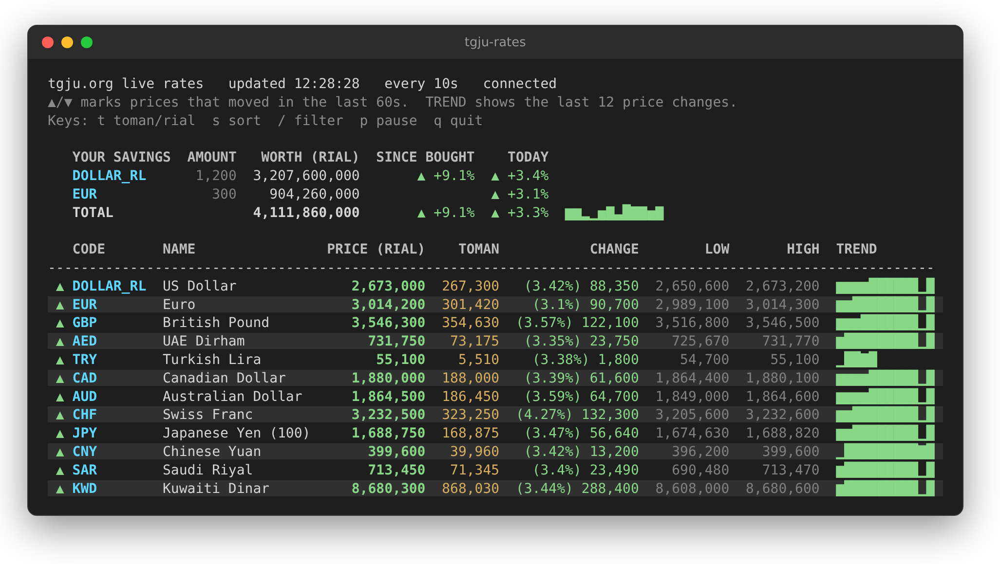

# tgju-rates

Live Iranian rial exchange rates from [tgju.org](https://www.tgju.org/currency) in your terminal.

- Updates in place: only the rows whose prices changed are redrawn, so the screen doesn't flicker.
- Prices in rial and toman, daily change, low and high.
- ▲/▼ markers on prices that just moved, and a sparkline of each currency's recent changes.
- A short trading-screen animation on every price change: flash, glow, rolling digits or both. Or none.
- A watchlist, and price alerts with desktop notifications.
- Toman mode (`--toman`) and JSON output (`--json`) for scripts.
- Price history saved to a local SQLite file, so sparklines survive restarts and past prices can be listed.
- No dependencies. Only the Python standard library is used.



## Installation

Requires Python 3.9 or newer.

```sh
git clone https://github.com/moxart/tgju-rates.git
cd tgju-rates
pip install .
```

On distributions that mark the system Python as externally managed (recent Ubuntu, Debian, Fedora), plain `pip install` refuses to run. Install with `pipx install .` instead, or inside a virtual environment.

You can also run it from the source tree without installing: `PYTHONPATH=src python3 -m tgju_rates`.

## Usage

```sh
tgju-rates                       # live, refresh every 10 seconds
tgju-rates -i 5                  # refresh every 5 seconds (minimum 3)
tgju-rates --once                # print the table once and exit
tgju-rates --persian             # add a column with the Persian names
tgju-rates --animation roll      # flash (default), glow, roll, board or off
tgju-rates --watch usd,eur,gbp   # show only these currencies, in this order
tgju-rates --market coin,gold    # gold coins and gold instead of currencies (currency, coin, gold, crypto, all)
tgju-rates --watch usd,emami,btc # mix markets; each code's market is fetched as needed
tgju-rates --dashboard           # currencies, coins, gold and crypto as panels on one screen
tgju-rates --alert "usd>2600000" --alert "eur<=2,850,000"
tgju-rates --toman               # prices in toman; --alert limits are read as toman too
tgju-rates --hold usd=1200@2,450,000 --hold eur=300   # what your savings are worth
tgju-rates --alert "total>5,000,000,000"              # alert on your savings' total
tgju-rates --once --json         # one JSON object; live mode with --json prints one per update (JSON Lines)
tgju-rates --history usd         # saved USD prices from the last day
tgju-rates --history eur --days 7 --toman
tgju-rates --history usd --days 30 --chart   # a chart and a daily open/low/high/close table
tgju-rates --history usd --days 30 --csv > usd.csv
tgju-rates --convert "250 usd"                # 250 USD in rial and toman
tgju-rates --convert "50,000,000 toman to btc"
tgju-rates --doctor              # check that tgju.org still works with this program
```

Currency codes are the site's codes in lower case (`eur`, `gbp`, `aed`, ...). `usd` is accepted for the
US dollar. An unknown code prints the list of valid ones.

### Gold coins, gold and crypto

`--market` picks what the table shows: `currency` (the default), `coin`, `gold`, `crypto`, or a
comma-separated mix, or `all`. Their codes work everywhere a currency code does: `--watch`, `--alert`,
`--hold`, `--history` and `--convert`.

| Market | Codes |
| --- | --- |
| `coin` | `emami` (Emami), `bahar` (Bahar Azadi), `nim` (half), `rob` (quarter), `gerami` (gram coin) |
| `gold` | `gold18`, `gold24` (per gram), `mesghal` (mithqal), `usedgold`, `silver` (999), `silver925` |
| `crypto` | `btc`, `eth`, `usdt`, `bnb`, `xrp`, `usdc`, `sol`, `trx`, `doge`, `ada`, `ton`, `link`, `xlm`, `ltc`, `bch`, `avax`, `dot`, `xmr`, `shib` |

All prices are in rial (toman with `--toman`), so a coin or a gram of gold can go in your savings:
`--hold emami=2@2,400,000,000 --hold gold18=15.5`. `tgju-rates --help` lists the codes too.

### Dashboard

`--dashboard` shows one panel per market (currencies, gold coins, gold & silver, crypto) with the
main codes of each: price, today's change in percent and, when live, the trend. The panels go side
by side as far as the terminal is wide, so four panels sit 2×2 at about 130 columns and in a single
row at about 150. `--watch` picks your own codes, which are grouped into panels by market, and
`--market` limits which panels appear:

```sh
tgju-rates --dashboard --toman
tgju-rates --dashboard --watch usd,eur,try,emami,rob,btc,usdt
tgju-rates --dashboard --market coin,gold
```

The keys, animations, alerts and savings panel work the same as in the table view.

### Converter

`--convert` turns an amount into rial and toman, or into another code, using live prices, then exits:

```sh
$ tgju-rates --convert "250 usd eur"
250 USD = 221.38 EUR
  1 USD (US Dollar) = 2,679,000 rial
  1 EUR (Euro) = 3,025,400 rial
```

Write `AMOUNT CODE`, `AMOUNT CODE CODE`, or put `rial`/`toman` on either side (`"50,000,000 toman to
btc"`); `to` and `in` are optional. `--json` prints the result as JSON. Yen is priced per 100 on the site,
and the converter accounts for that. If the feed can't be reached, the last prices saved in the history
file are used and the output says so.

Alert limits are in **rial**. An alert fires once when its condition becomes true and fires again only
after the condition has stopped holding in between. Fired alerts are listed above the table and sent as a
desktop notification when `notify-send` is available. Alerts work on any currency, including ones not
in `--watch`.

### Your savings

List the currencies you hold, and a panel above the table shows what each is worth now, how much it has
gained since you bought it, and today's move, with a TOTAL row and a sparkline of your total:

```
   YOUR SAVINGS  AMOUNT   WORTH (RIAL)  SINCE BOUGHT    TODAY
   USD            1,200  3,101,580,000     ▲ +26.6%   ▲ +0.8%
   EUR              300    877,050,000                ▼ -0.5%
   TOTAL                 3,978,630,000     ▲ +26.6%   ▲ +0.5%  ▁▃▂▆█
```

Write each holding as `code=amount`, or `code=amount@price` with the price you paid per unit. Put them in
`~/.config/tgju-rates/holdings.txt` (or `--holdings PATH`), one per line:

```
# code=amount@price paid per unit
usd=1200@2,450,000
eur=300                 # no price: shows worth and today's move, but no gain
gbp=0.5@330,000 toman
```

or pass them with `--hold`, which replaces the file's line for the same currency. Prices in the file are
rial unless you write `toman` after them; `--hold` prices follow `--toman`, like `--alert` limits. SINCE
BOUGHT on the TOTAL row covers only the holdings with a price. `--alert "total>LIMIT"` fires when your
total crosses the limit, and `--json` adds a `holdings` object.

### Keys

In live mode in a terminal, single keys change the view without restarting:

| Key | Does |
| --- | --- |
| `t` | switch between toman and rial |
| `s` | sort: site order, biggest move today, highest price |
| `/` | filter by code or English name as you type; Enter keeps it, Esc clears it |
| `c` | convert, e.g. `250 usd eur`; the result updates as you type and with each new price |
| `a` | next price animation: flash, glow, roll, board, off |
| `Esc` | clear the filter and the converter |
| `p` | pause and resume updates |
| `q` | quit (Ctrl+C works too) |

`t` only changes the display. `--alert` limits stay in the unit they were given in.

`c` takes the same input as `--convert` but uses the prices already on screen, so it works only for loaded
markets (`--market coin` for `emami`, for example). Enter keeps the line above the table; `c` edits it
again.

### Animations

When a price changes, its price and second-unit cells play a short effect (1.5 seconds) in green for a rise
or red for a fall:

| `--animation` | Effect |
| --- | --- |
| `flash` | the cell lights up and fades back into the row (default) |
| `glow` | the digits flare white, then cool from bright green or red to normal |
| `roll` | only the digits that changed spin and land on the new value, left to right |
| `board` | `roll` and `flash` together |
| `off` | no animation; the ▲/▼ marker and coloured price still show the move |

Press `a` to try them while it runs. Animations only play in a colour terminal; piped output and
`--json` never animate.

Piped output (`tgju-rates > rates.log`) has no colours, ignores keys and appends a full table on every update.

### JSON

`--json` prints numbers instead of formatted text: `price`, `change`, `low` and `high` are integers in
the unit given by `"unit"` (`"rial"`, or `"toman"` with `--toman`), and `change_percent` is a float. Fields
the site didn't fill are `null`. Alerts that fired on that update are listed under `"alerts"`.

```sh
tgju-rates --once --json --watch usd | jq '.rates[0].price'
tgju-rates --json --watch usd,eur > rates.jsonl
```

### History

Every run saves prices to `~/.local/share/tgju-rates/history.db` (or `$XDG_DATA_HOME/tgju-rates/`). A row
is written only when a price changes. Live mode starts its TREND sparklines from this file, and
`--history CODE` lists what was saved. Add `--chart` for a chart over the `--days` window with a table of
each day's open, low, high and close, `--csv` for a spreadsheet, or `--json` for scripts. Use `--db PATH`
for a different file and `--no-record` to not save anything. If the file can't be opened, the program
warns and runs without it.

```
USD (US Dollar), last 7 day(s), in rial

2,685,000 ┤                                                    ███▂▂
          │                                                  ▇▇█████
2,634,825 ┤                                                  ███████
          │                                                  ███████
2,584,650 ┤                                         ▁▁▁▁▁▁▁▁▁███████
          └─────────────────────────────────────────────────────────
           2026-09-27 01:32                         2026-10-04 01:32

DATE             OPEN        LOW       HIGH      CLOSE           CHANGE
2026-10-02  2,584,650  2,584,650  2,584,650  2,584,650
2026-10-03  2,669,700  2,666,750  2,685,200  2,679,000  +94,350 (+3.7%)
```

Prices are only saved while the program runs, so gaps in the chart are times it wasn't running.

### Shell completion

`--completion bash|zsh|fish` prints a completion script for options and codes:

```sh
tgju-rates --completion bash > ~/.local/share/bash-completion/completions/tgju-rates
tgju-rates --completion fish > ~/.config/fish/completions/tgju-rates.fish
echo 'eval "$(tgju-rates --completion zsh)"' >> ~/.zshrc   # after compinit
```

### Troubleshooting

`tgju-rates --doctor` checks each part: the currency page parses, the feed answers, every currency and
every coin, gold and crypto entry is in the feed, and the history and holdings files can be read. It
exits with status 1 if anything failed, which makes its output a good start for a bug report.

## How it works

1. At startup, the [currency page](https://www.tgju.org/currency) is scraped once to find which
   currencies to show and their Persian names. Coins, gold and crypto aren't scraped: the feed already
   has them, and `markets.py` lists which entries to show.
2. While running, prices are polled from `https://call1.tgju.org/ajax.json`, the feed the site uses for
   its own live updates. A unique query string gets around its 5-minute CDN cache. After a failed poll
   the wait doubles each time (up to 2 minutes) and goes back to normal on the next success.

If tgju.org changes its page markup, the scraper is the part that breaks. The program then starts from
the list of currencies saved in the history file, says so above the table, and keeps updating prices from
the feed if that still works. With nothing saved, it exits with the error. `--doctor` shows which part
broke.

## Project layout

```
src/tgju_rates/
├── cli.py         argument parsing and the entry point
├── app.py         --once mode and the live polling loop
├── source.py      scraping the page and reading the JSON feed
├── markets.py     the coin, gold and crypto entries taken from the feed
├── currencies.py  currency codes, English names, rial/toman formatting
├── convert.py     --convert
├── chart.py       --history --chart
├── doctor.py      --doctor
├── completion.py  shell completion scripts
├── tracking.py    price moves between polls and trend history
├── history.py     the SQLite price history
├── export.py      JSON output
├── alerts.py      alert rules and desktop notifications
├── table.py       rendering the table, sparklines and colours
├── dashboard.py   --dashboard: one panel per market, laid out in a grid
├── screen.py      flicker-free in-place terminal updates
└── ansi.py        terminal escape codes and the colour palette
tests/             unit tests (offline, no network needed)
```

## Development

```sh
python3 -m venv .venv && . .venv/bin/activate
pip install -e . ruff
python -m unittest discover -s tests   # tests
ruff check . && ruff format --check .  # lint and formatting
```

A currency the site adds later shows `-` as its name until it gets an entry in `ENGLISH_NAMES` in
`currencies.py`.

## Disclaimer

This is an unofficial tool and is not affiliated with tgju.org. All data belongs to tgju.org. Please
keep the refresh interval reasonable.

## License

[MIT](LICENSE)
